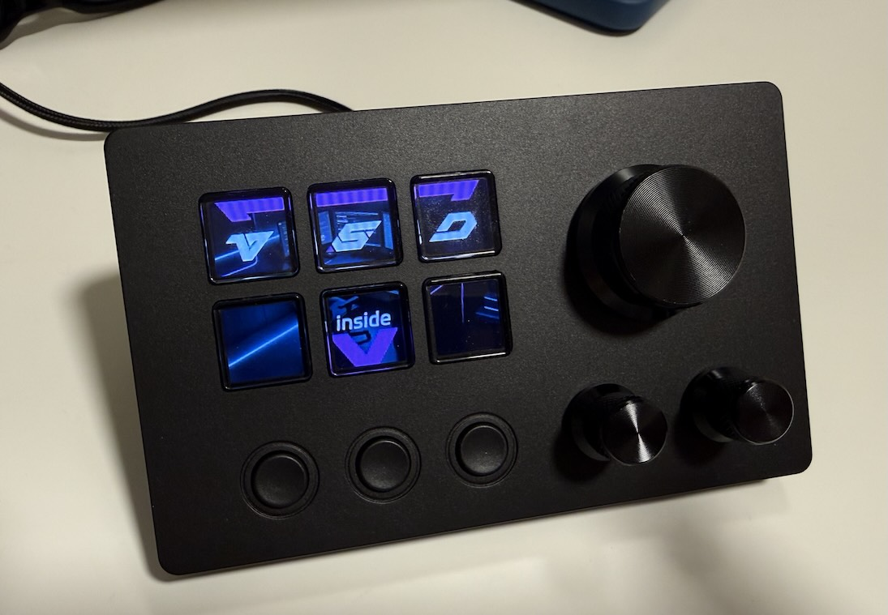

# StreamDeckController

<p align="center">
  
</p>

A lightweight macOS daemon that drives budget USB stream decks — turning hardware buttons and knobs into app launchers, system volume controls, and external monitor brightness dials. Written in Swift, it talks directly to the device over USB HID, parses the proprietary "CRT" packet protocol, and maps every button press, knob rotation, and knob click to configurable actions defined in a single JSON file. The daemon runs as a LaunchAgent with no GUI, no menu bar icon, and no dock presence; it starts at login, reconnects automatically if the deck is unplugged and re-plugged, and reloads its configuration on `SIGHUP` without a restart.

Technically, it uses IOKit's `IOHIDManager` to claim the device by USB vendor/product ID (`0x5548:0x1001`), registers an input-report callback on the main `CFRunLoop`, and dispatches parsed events through an action router. Actions include launching apps via shell commands, simulating keyboard shortcuts through `CGEvent`, adjusting system volume via CoreAudio, and controlling external monitor brightness over DDC/CI using [`m1ddc`](https://github.com/waydabber/m1ddc). LCD button icons are loaded from `.icns` files, JPEG-compressed, and pushed to the device over a chunked image transfer protocol. A 5-second keepalive packet prevents the device from going to sleep.

### Why this exists

The manufacturer-supplied software ("VSD Craft") is a ~980 MB Qt app bundled with 3,800+ files, a virtual keyboard plugin, and its own HTTP stack — all for what amounts to "press button, do thing." This daemon replaces it with a ~500 KB native binary, zero dependencies beyond what ships with macOS (plus `m1ddc` if you want monitor brightness control), and a JSON config you can edit in any text editor.

## Hardware

**Primary target:** [TreasLin N3](https://www.amazon.com/dp/B0D2M1Y18C) — a budget USB stream deck with 6 LCD keys, 3 tactile buttons, 1 large rotary encoder, and 2 small rotary encoders. All encoders are also push-buttons.

**Known clones / rebrands** that share the same USB VID/PID (`0x5548:0x1001`) and CRT protocol — this controller should work with them out of the box:

- TreasLin N3 Pro
- Mirabox HSV602
- AJAZZ AKP03
- DOPWii / KKM-K3 (6-key + 3-knob variant)

If your device enumerates with VID `0x5548` / PID `0x1001` and speaks the CRT packet protocol, it will almost certainly work.

### Physical layout

```
┌─────────────────────────────────────────────────┐
│  [LCD 1]  [LCD 2]  [LCD 3]       ╭───────╮     │
│                                   │  BIG  │     │
│  [LCD 4]  [LCD 5]  [LCD 6]       │ KNOB  │     │
│                                   ╰───────╯     │
│  (btn1)   (btn2)   (btn3)    (sm1)    (sm2)     │
└─────────────────────────────────────────────────┘
```

- **LCD keys** — 72x72 pixel displays under each keycap. The daemon pushes JPEG icons at startup.
- **Standard buttons** — simple press/release, no display.
- **Knobs** — infinite rotary encoders with push-click. Each detent fires a single CW or CCW event.

### Protocol notes

The device uses 1025-byte HID reports (1-byte report ID + 1024-byte payload). Outbound commands are prefixed with `CRT\0\0`. Inbound events are prefixed with `ACK`. A `CONNECT` keepalive must be sent every 5 seconds or the device goes dark. LCD images are transferred via a `BAT` header (image length + key index) followed by raw JPEG data chunks.

## Example configuration

Below is an example setup — customise `config.json` to suit your workflow.

| Control | Action |
|---------|--------|
| LCD 1–6 | Launch apps (Safari, Terminal, etc.) with custom icons |
| Big knob rotate | System volume (step 5, ~10% per tick) |
| Big knob press | Mute / unmute system audio |
| Small knob 1 | App-specific volume (via distributed notifications) |
| Small knob 2 rotate | External monitor brightness (DDC/CI, step 5) |
| Small knob 2 press | Cycle brightness target: All &rarr; Monitor 1 &rarr; Monitor 2 &rarr; All |
| btn 1 / 2 / 3 | Unassigned (yours to map) |

Monitor brightness control identifies displays by serial number (from `m1ddc display list detailed`). A floating HUD overlay with large text appears on all screens showing the current brightness and target mode. The target auto-reverts to "All" after 30 seconds of inactivity.

## Installation

### Prerequisites

- macOS 13 (Ventura) or later, Apple Silicon
- Xcode Command Line Tools (`xcode-select --install`)
- [Homebrew](https://brew.sh) (only needed for `m1ddc` if you want monitor brightness)

### 1. Clone and build

```bash
git clone https://github.com/YOUR_USERNAME/StreamDeckController.git
cd StreamDeckController
swift build -c release
```

### 2. Install m1ddc (optional — only for monitor brightness)

```bash
brew install m1ddc
```

Find your monitor serials:

```bash
m1ddc display list detailed
```

Look for the `AN Serial` line for each display.

### 3. Create your config

```bash
mkdir -p ~/.config/vsd
cp config.example.json ~/.config/vsd/config.json
```

Edit `~/.config/vsd/config.json` to map your buttons and knobs. See [Action types](#action-types) below.

If using monitor brightness, add your display serials to the `displays` array:

```json
"displays": [
  { "name": "Left",  "serial": "YOUR_AN_SERIAL_1" },
  { "name": "Right", "serial": "YOUR_AN_SERIAL_2" }
]
```

### 4. Deploy the binary

```bash
mkdir -p ~/Library/Application\ Support/StreamDeckController
cp .build/release/StreamDeckController ~/Library/Application\ Support/StreamDeckController/
cp Info.plist ~/Library/Application\ Support/StreamDeckController/
```

### 5. Install the LaunchAgent

Edit `com.streamdeck.controller.plist` — replace every `YOUR_HOME` with your actual home directory (run `echo $HOME` to find it), then:

```bash
sed "s|YOUR_HOME|$HOME|g" com.streamdeck.controller.plist > ~/Library/LaunchAgents/com.streamdeck.controller.plist
launchctl bootstrap gui/$(id -u) ~/Library/LaunchAgents/com.streamdeck.controller.plist
```

The daemon starts immediately and will auto-start on login.

### 6. Grant permissions

On first run, macOS may prompt for:

- **Input Monitoring** — required for the `key:` action type (simulating keyboard shortcuts via `CGEvent`). Go to System Settings &rarr; Privacy & Security &rarr; Input Monitoring and add `StreamDeckController`.
- **Accessibility** — not required. Volume control uses CoreAudio directly.

### Managing the daemon

```bash
# Reload config without restart
killall -HUP StreamDeckController

# Stop
launchctl bootout gui/$(id -u) ~/Library/LaunchAgents/com.streamdeck.controller.plist

# Start
launchctl bootstrap gui/$(id -u) ~/Library/LaunchAgents/com.streamdeck.controller.plist

# View logs
tail -f ~/Library/Logs/StreamDeckController.log
```

## Action types

| Action | Format | Example |
|--------|--------|---------|
| Launch app / run command | `shell:<command>` | `shell:open -a 'Slack'` |
| Keyboard shortcut | `key:<combo>` | `key:cmd+shift+s` |
| System volume | `system_volume` | Requires `step` in config |
| System mute | `system_mute_toggle` | — |
| Monitor brightness | `display_brightness` | Requires `step` and `displays` in config |
| Cycle brightness target | `display_brightness_cycle` | — |
| Do nothing | `none` | — |

Keyboard shortcuts support modifiers `cmd`, `shift`, `ctrl`, `alt`/`opt` and keys `a`–`z`, `0`–`9`, `f1`–`f12`, arrow keys, `space`, `return`, `tab`, `escape`, `delete`.

## Config reference

```jsonc
{
  "brightness": 50,              // LCD key backlight (0–100)
  "buttons": {
    "lcd_1": {
      "action": "shell:open -a 'Safari'",
      "icon": "/Applications/Safari.app/Contents/Resources/AppIcon.icns"  // optional
    },
    "btn_1": { "action": "key:cmd+shift+a" }
  },
  "knobs": {
    "big": {
      "rotate": { "action": "system_volume", "step": 5 },
      "press":  { "action": "system_mute_toggle" }
    }
  },
  "displays": [                  // optional, for monitor brightness
    { "name": "Left", "serial": "AN_SERIAL_FROM_M1DDC" }
  ]
}
```

Valid button keys: `lcd_1` through `lcd_6`, `btn_1` through `btn_3`.
Valid knob keys: `big`, `small_1`, `small_2`. Each has `rotate` and `press` sub-actions.

## History

This project was originally developed under the name "VSD Display Controller" / "VSDDaemon", named after the manufacturer's software ("VSD Craft"). It was renamed to **StreamDeckController** to better describe what it actually does. You may still see `VSD` or `vsd` in some internal references — notably the config directory `~/.config/vsd/` which is kept for backward compatibility.

## License

MIT License — free to use, modify, and distribute with attribution. See [LICENSE](LICENSE) for the full text.

## If you build something with this

Not required by MIT — but I'd appreciate hearing about it. Open an [Issue](https://github.com/okoker/StreamDeckController/issues/new) tagged `show-and-tell`, leave a [star](https://github.com/okoker/StreamDeckController), or email <gitkoker@pm.me>.
